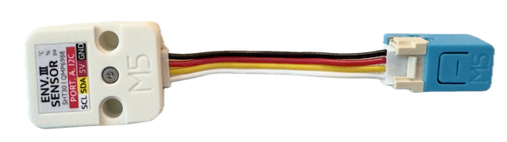
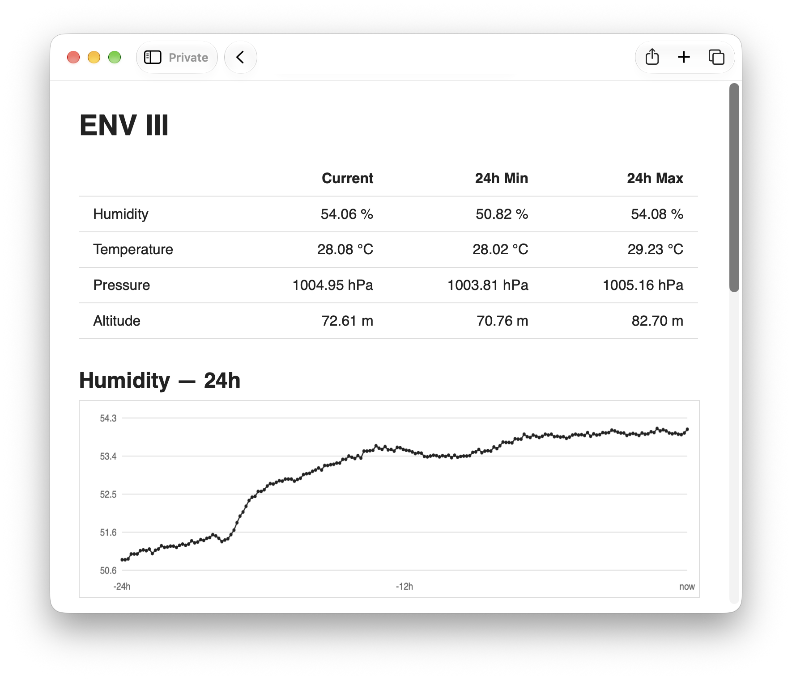
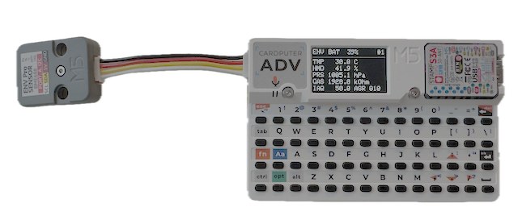
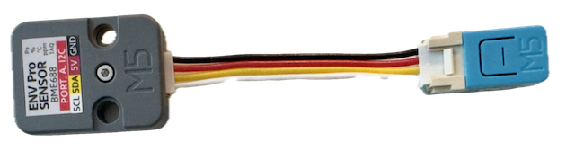
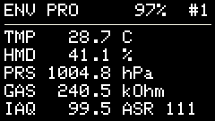
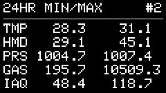
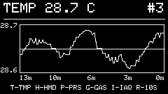
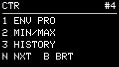

# ENV-GUCK
Environmental sensor monitoring via Web and ESP-NOW.

## C6-ENV-III-WEBSERVER


- ESP32-C6 + Env III Sensor 
- Connected to WiFi, works as Webserver
- Installed in workshop space
- Used for monitoring remotely



## CARDPUTER-ENV-PRO-STANDALONE

- M5Stack Cardputer ADV + ENV PRO Sensor
- Standalone operation without ESP32-C6

## C6-ENV-PRO-ESP-NOW-AP


- ESP32-C6 + ENV PRO Sensor
- Works as an Access Point and Webserver
- Transmits sensor values via ESP-NOW 
- Installed in Automobile
- Used for monitoring the environment during car living
```text
                         ┌── Wi-Fi → Web Browser
NanoC6 + ENV PRO ────────┤
                         └── ESP-NOW → Cardputer
```

## CARDPUTER-ESP-NOW
C6-ENV-PRO-ESP-NOW-AP measures and calculates the 24-hour MIN/MAX; Cardputer receives that data, maintains its own 24-hour history, displays everything, handles keyboard control, and saves screenshots to microSD.

- Cardputer ADV
- Receives sensor data from ESP32-C6 via ESP-NOW
- Used in the automobile

 

 
### Keys
| Key | Function |
|---|---|
| `1` | ENV PRO — current sensor values |
| `2` | 24HR MIN/MAX |
| `3` | HISTORY — press again to cycle T/H/P/G/IAQ |
| `4` | CONTROL |
| `N` | Next page |
| `B` | Cycle display brightness |
| `T` | History: Temperature |
| `H` | History: Humidity |
| `P` | History: Pressure |
| `G` | History: Gas Resistance |
| `I` | History: IAQ |
| `R` | Cycle history interval: 10s / 30s / 60s |
| `Fn + S` | Save screenshot to microSD |

### History Interval
- `10s` — approximately 4 hours
- `30s` — approximately 12 hours
- `60s` — approximately 24 hours
- The first ESP-NOW packet immediately creates the first history point.
- History is stored locally on the Cardputer.
- 24HR MIN/MAX values are received directly from the NanoC6.

## System Overview
```text
 ┌─────────────────────┐                       ┌──────────────────────────┐
 │       NanoC6        │                       │      CARDPUTER ADV       │
 │                     │                       │                          │
 │ ESP32-C6 + ENV PRO  │                       │    ESP-NOW RECEIVER      │
 │                     │                       │            │             │
 │ T  Temperature      │                       │            ▼             │
 │ H  Humidity         │      ESP-NOW          │     ┌──────────────┐     │
 │ P  Pressure         │ ────────────────────► │     │  Latest Data │     │
 │ G  Gas Resistance   │    sensorPayload      │     │ T/H/P/G/IAQ  │     │
 │ I  IAQ              │                       │     └───────┬──────┘     │
 │                     │                       │             │            │
 │ 24H MIN / MAX       │                       │       ┌─────┴─────┐      │
 └──────────┬──────────┘                       │       ▼           ▼      │
            │                                  │   MIN / MAX    HISTORY   │
            │ Wi-Fi                            │   NanoC6        Local    │
            │                                  │                   │      │
            ▼                                  │                   ▼      │
 ┌─────────────────────┐                       │              1440 points │
 │   ACCESS POINT      │                       │               ≈ 24 hours │
 │     + WEB SERVER    │                       │                          │
 │                     │                       │     ┌────────────────┐   │
 │  Remote monitoring  │                       │     │    DISPLAY     │   │
 │  via web browser    │                       │     │                │   │
 │                     │                       │     │  1 ENV PRO     │   │
 │  Sensor values      │                       │     │  2 MIN/MAX     │   │
 │  Environment data   │                       │     │  3 HISTORY     │   │
 └─────────────────────┘                       │     │  4 CONTROL     │   │
                                               │     └────────────────┘   │
                                               └──────────────────────────┘
```
## License

[MIT](LICENSE)

